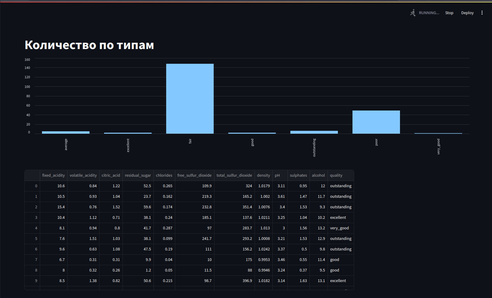

# scaling-octo-waddle

## Датасет

[ссылка на Kaggle](https://www.kaggle.com/code/derricksteven/pytorch-wine-classification)

Там же можно увидеть, что данные из разных классов имеют похожее распределение, поэтому все модели имеют точность `0.62`. 

## Претрейн модели

[вот тут ноутбук](./data/wine.ipynb)

Модели в `.pickle` весят много, на гит не копировал. Делать скрипт для автомативеского создания внутри контейнера делать не стал. 

Модели должны лежать в `./models/*`.

## Run
```
docker-compose up -d
```

## Dashboard:

http://localhost:8501

По полученным данным происходит построение bar chart и для лучших категорий составляется таблица характеристик.



## Stop
```
docker-compose stop
```